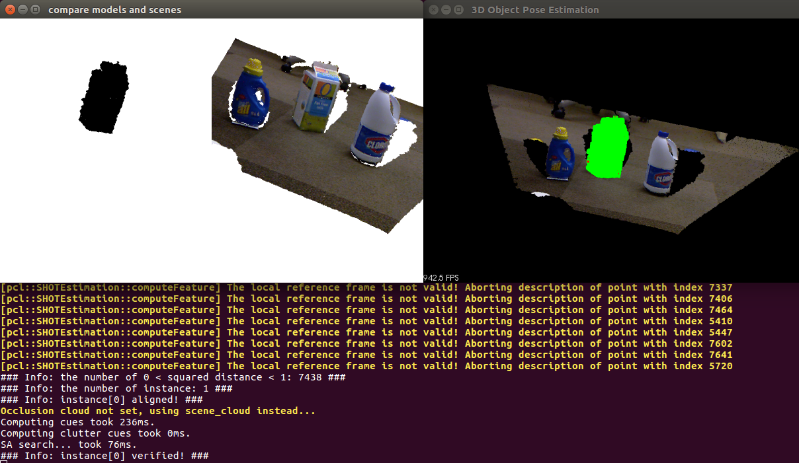

# ObjectPoseEstimation
Use Point Cloud Library to implement 3D object recognition and locate target objects in complex scenes.



# How to compile and execute the program

>$ mkdir build

>$ cd build

>$ cmake ..

>$ make

>$ ../run_demo.sh

# How to install Point Cloud Library v1.8 on Ubuntu 16

>$ sudo rm -rf /etc/apt/sources.list.d/webupd8team*

>$ sudo apt-get update

>$ sudo add-apt-repository ppa:webupd8team/java

>$ sudo apt-get update

>$ sudo apt-get install oracle-java8-installer

```
E: Package 'oracle-java8-installer' has no installation candidate

Download the latest JAVA 8 SE development kit from here:
https://www.oracle.com/technetwork/java/javase/downloads/java-archive-javase8-2177648.html
```

>$ tar -zxf jdk-8u202-linux-x64.tar.gz -C ~/

>$ sudo gedit /etc/profile
```
export JAVA_HOME=/home/hjc/jdk1.8.0_202
export JRE_HOME=/home/hjc/jdk1.8.0_202/jre
export CLASSPATH=/home/hjc/jdk1.8.0_202/lib:/home/hjc/jdk1.8.0_202/jre/lib:/home/hjc/jdk1.8.0_202/lib/tools.jar
export PATH=/home/hjc/jdk1.8.0_202/bin:/home/hjc/bin:$PATH
```
>$ java -version
>java version "1.8.0_202"
>Java(TM) SE Runtime Environment (build 1.8.0_202-b08)
>Java HotSpot(TM) 64-Bit Server VM (build 25.202-b08, mixed mode)

>$ sudo apt -y install g++ cmake cmake-gui doxygen mpi-default-dev openmpi-bin openmpi-common libusb-1.0-0-dev libqhull* libusb-dev libgtest-dev

>$ sudo apt -y install git-core freeglut3-dev pkg-config build-essential libxmu-dev libxi-dev libphonon-dev libphonon-dev phonon-backend-gstreamer

>$ sudo apt -y install phonon-backend-vlc graphviz mono-complete qt-sdk libflann-dev

>$ sudo apt -y install libflann1.8 libboost1.58-all-dev

>$ cd ~/workspace

>$ wget http://launchpadlibrarian.net/209530212/libeigen3-dev_3.2.5-4_all.deb

>$ sudo dpkg -i libeigen3-dev_3.2.5-4_all.deb

>$ sudo apt-mark hold libeigen3-dev

>$ wget http://www.vtk.org/files/release/7.1/VTK-7.1.0.tar.gz

>$ tar -xf VTK-7.1.0.tar.gz

>$ cd VTK-7.1.0 && mkdir build && cd build

>$ cmake ..

>$ make

>$ sudo make install

>$ cd ~/workspace

>$ wget https://github.com/PointCloudLibrary/pcl/archive/pcl-1.8.0.tar.gz

>$ tar -xf pcl-1.8.0.tar.gz

>$ cd pcl-pcl-1.8.0 && mkdir build && cd build

>$ cmake ..

>$ make

>$ sudo make install

>$ cd ~/workspace

>$ mkdir pclTest

>$ cd pclTest

First, create a CMakeLists.txt file:

```
cmake_minimum_required(VERSION 2.8 FATAL_ERROR)
project(pclTest)
find_package(PCL 1.2 REQUIRED)

include_directories(${PCL_INCLUDE_DIRS})
link_directories(${PCL_LIBRARY_DIRS})
add_definitions(${PCL_DEFINITIONS})

add_executable(pclTest pclTest.cpp)
target_link_libraries(pclTest ${PCL_LIBRARIES})

SET(COMPILE_FLAGS "-std=c++11")
add_definitions(${COMPILE_FLAGS})
```

Second, create a pclTest.cpp file:

```
#include <iostream>

#include <pcl/io/pcd_io.h>
#include <pcl/point_types.h>

int
main(int   argc,
     char* argv[]) // ./test_saveing.pcd
{
    int iResult = 0;

    do
    {
        pcl::PointCloud<pcl::PointXYZ> vecPointCloud;

        // Fill in the vecPointCloud data
        vecPointCloud.width    = 2;
        vecPointCloud.height   = 1;
        vecPointCloud.is_dense = false;
        vecPointCloud.resize(vecPointCloud.width * vecPointCloud.height);

        for(auto& point: vecPointCloud)
        {
            point.x = 1024 * rand () / (RAND_MAX + 1.0f);
            point.y = 1024 * rand () / (RAND_MAX + 1.0f);
            point.z = 1024 * rand () / (RAND_MAX + 1.0f);
        }

        // Save all point data to test_saveing.pcd
        if (-1 == pcl::io::savePCDFileASCII(argv[1],
                                            vecPointCloud))
        {
            std::cerr << "!!! Err: savePCDFileASCII failed !!!" << std::endl;
            iResult = -1;
            break;
        }

        std::cerr << "###Info: Saved "
                  << vecPointCloud.size()
                  << " points to test_saveing.pcd ###"
                  << std::endl;

        pcl::PointCloud<pcl::PointXYZ>::Ptr pvecPointCloud(new pcl::PointCloud<pcl::PointXYZ>);

        if (-1 == pcl::io::loadPCDFile(argv[1],
                                       *pvecPointCloud))
        {
            std::cerr << "!!! Err: loadPCDFile failed !!!" << std::endl;
            iResult = -2;
            break;
        }

        // Point Cloud Information
        std::cout << argv[1]
                  << " Loaded the number of points: "
                  << pvecPointCloud->points.size()
                  << "\nHeight: "
                  << pvecPointCloud->height
                  << "\nWidth："
                  << pvecPointCloud->width
                  << std::endl;

        for(const auto& point: *pvecPointCloud)
        {
            std::cout << "   "
                      << point.x
                      << "   "
                      << point.y
                      << "   "
                      << point.z
                      << std::endl;
        }
    }while(0);

    return iResult;
}
```

Third, compile:

>$ mkdir build && cd build

>$ cmake ..

>$ make

```
/usr/bin/ld: warning: libOpenNI.so.0, needed by /usr/local/lib/libpcl_io.so, not found (try using -rpath or -rpath-link)

$ sudo apt install libopenni-dev
```

Fouth, test:

>$ ./pclTest ./test_saveing.pcd
```
###Info: Saved 2 points to test_saveing.pcd ###
./test_saveing.pcd Loaded the number of points: 2
Height: 1
Width：2
   0.352222   -0.151883   -0.106395
   -0.397406   -0.473106   0.292602
```